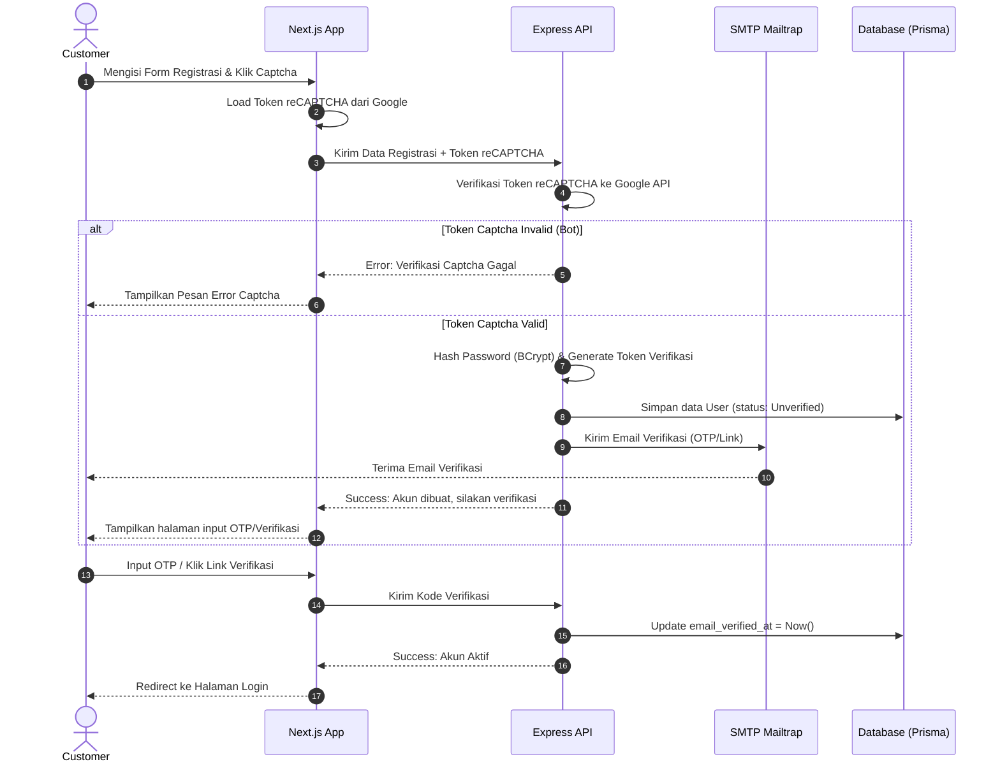
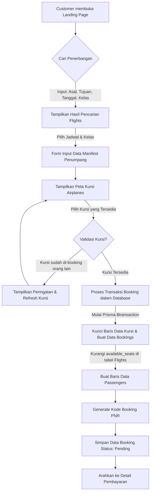
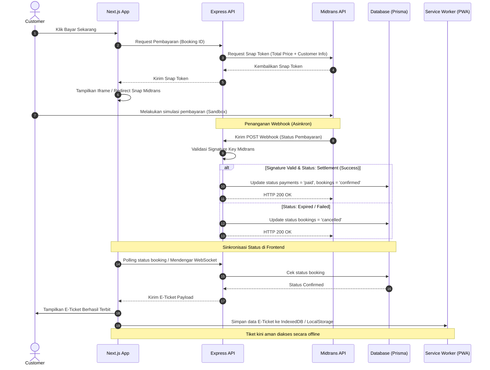
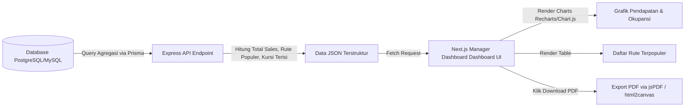

# Product Requirements Document (PRD)
## Sistem Informasi Maskapai Penerbangan Online (Flight Booking System)

---

## 1. Executive Summary

### Problem Statement
Proses pemesanan tiket pesawat secara konvensional seringkali tidak efisien, rentan terhadap kesalahan input data manifest, dan lambat dalam proses verifikasi pembayaran. Di sisi lain, bagi pengelola maskapai (admin/staff), manajemen jadwal penerbangan, alokasi kursi pesawat, serta pemantauan kapasitas penumpang secara manual berisiko menimbulkan *double-booking*. Selain itu, pihak manajemen (Top Level Management) membutuhkan visibilitas data penjualan dan rute penerbangan terpopuler secara real-time untuk pengambilan keputusan bisnis yang cepat dan akurat.

### Proposed Solution
Membangun **Sistem Informasi Maskapai Penerbangan Online** berbasis web yang modern dan responsif menggunakan **Next.js (Frontend)**, **Express (Backend)**, **Prisma (ORM)**, dan **TailwindCSS (Styling)**. Sistem ini akan mencakup:
*   Pencarian jadwal penerbangan real-time dan pemilihan kursi secara interaktif.
*   Integrasi pembayaran otomatis menggunakan **Midtrans Sandbox**.
*   Sistem keamanan login menggunakan **Google reCAPTCHA v2/v3** dan verifikasi akun via **SMTP/Mailtrap**.
*   Kemampuan offline-first khusus untuk melihat E-Ticket yang sudah dipesan (PWA/Local Caching).
*   Dashboard pelaporan analitis terperinci untuk **Manager** demi mendukung keputusan bisnis.

### Success Criteria (KPIs)
*   **Kecepatan Pencarian**: Halaman pencarian penerbangan memberikan hasil filter rute dalam waktu $< 300\text{ ms}$ untuk dataset penerbangan berskala menengah.
*   **Automasi Pembayaran**: $100\%$ transaksi terbayar melalui Midtrans terverifikasi otomatis secara real-time oleh sistem melalui webhook.
*   **Keamanan Sistem**: $0$ registrasi/login bot berkat proteksi reCAPTCHA. Semua akun customer terverifikasi melalui email sebelum dapat melakukan booking.
*   **Offline Access**: Customer dapat membuka dan menunjukkan E-Ticket mereka meskipun dalam kondisi koneksi internet terputus (luring/offline).
*   **Akurasi Kursi**: Kebocoran kapasitas kursi (double-booking pada nomor kursi yang sama di penerbangan yang sama) bernilai $0\%$.

---

## 2. User Experience & Functionality

### User Personas
1.  **Customer (Penumpang)**: Pengguna umum yang mencari penerbangan, memesan tiket, memilih kursi, membayar secara online, dan mengunduh E-Ticket.
2.  **Staff (Ticketing Officer/Operator)**: Pengguna operasional yang memantau jadwal penerbangan, mengelola manifest penumpang, dan memverifikasi isu booking secara manual jika diperlukan.
3.  **Admin (Sistem Administrator)**: Pengguna dengan akses penuh untuk mengelola master data bandara, maskapai, armada pesawat, tata letak kursi, serta akun pengguna.
4.  **Manager (Top Level Management)**: Pengguna eksekutif yang memerlukan visualisasi analitik penjualan tiket, rute favorit, okupansi kelas penerbangan, dan laporan pendapatan maskapai.

### Reverse Engineering: Membedah PDM Menjadi Fitur MVP
Berdasarkan Physical Data Model (PDM) pada dokumen [SMK TI BAZMA - Tugas Praktek-1.pdf](file:///c:/Users/Hp/OneDrive/Documents/bdeul/code/test-ukk-3gen/SMK%20TI%20BAZMA%20-%20Tugas%20Praktek-1.pdf), berikut pemetaan tabel database menjadi fungsionalitas sistem:

| Tabel PDM | Kunci Data Terkait | Fitur Hasil Reverse Engineering | Penerapan Pada Role |
| :--- | :--- | :--- | :--- |
| **`users`** | `role`, `email_verified_at`, `password` | • **Registrasi & Login**: Form login dengan Google reCAPTCHA.<br>• **Verifikasi Email**: Kode verifikasi dikirim via email.<br>• **Role-Based Access Control (RBAC)**: Pembatasan akses halaman berdasarkan peran pengguna (Admin, Staff, Customer, Manager). | Semua User |
| **`airports`** | `iata_code`, `city`, `country`, `name` | • **Manajemen Bandara (CRUD)**: Pengelolaan database bandara.<br>• **Pencarian Bandara Autocomplete**: Input pencarian rute asal & tujuan berdasarkan nama kota atau kode IATA. | Admin, Customer |
| **`airlines`** | `code`, `logo`, `photos` | • **Manajemen Maskapai (CRUD)**: Mengelola identitas maskapai, kode panggil, dan logo maskapai untuk brand penerbangan. | Admin |
| **`airplanes`** | `airline_id`, `capacity`, `model` | • **Manajemen Armada (CRUD)**: Mengelola daftar pesawat yang dimiliki oleh setiap maskapai beserta kapasitas maksimalnya. | Admin |
| **`seats`** | `airplane_id`, `seat_number`, `class` | • **Konfigurasi Kursi**: Peta layout kursi untuk kelas Economy, Business, dan First Class.<br>• **Interactive Seat Picker**: Memilih kursi kosong secara visual saat melakukan booking tiket. | Admin, Customer |
| **`flights`** | `departure_airport_id`, `arrival_airport_id`, `departure_time`, `price`, `available_seats` | • **Manajemen Rute & Jadwal (CRUD)**: Mengatur rute penerbangan, estimasi waktu berangkat-tiba, harga tiket, dan kalkulasi dinamis sisa kursi yang tersedia.<br>• **Flight Search Engine**: Pencarian penerbangan satu arah/pulang-pergi berdasarkan filter tanggal, kota asal-tujuan, dan kelas. | Staff, Admin, Customer |
| **`bookings`** | `booking_code`, `status`, `total_price` | • **Reservasi Tiket**: Pembuatan kode booking unik (PNR), penghitungan harga total tiket (termasuk kelas kursi), serta status reservasi (`pending`, `confirmed`, `cancelled`). | Customer, Staff |
| **`passengers`** | `booking_id`, `seat_number`, `passport_number` | • **Manifest Penumpang**: Pengisian data setiap penumpang (nama lengkap, gender, tgl lahir, nomor paspor/NIK, dan nomor kursi terpilih).<br>• **E-Ticket Generator**: Sistem menghasilkan E-ticket digital berisikan detail penerbangan dan manifest. | Customer, Staff |
| **`payments`** | `booking_id`, `payment_method`, `payment_status`, `transaction_code` | • **Integrasi Midtrans Payment Gateway**: Pembayaran terintegrasi via Virtual Account, E-Wallet, atau Kartu Kredit.<br>• **Webhook Listener**: Penanganan notifikasi pembayaran otomatis untuk mengubah status booking menjadi `confirmed`. | Customer, Manager |

### User Stories & Acceptance Criteria

#### 1. Registrasi & Autentikasi User (Tabel `users`)
*   **User Story**:
    *   *As a* Customer, *I want to* mendaftar akun dan login dengan verifikasi email dan reCAPTCHA, *so that* akun saya aman dari penyalahgunaan dan bot.
*   **Acceptance Criteria**:
    *   Form registrasi memicu pengiriman email aktivasi link/OTP menggunakan SMTP NodeMailer.
    *   User tidak dapat login/booking sebelum melakukan verifikasi email (`email_verified_at` bernilai timestamp).
    *   Halaman login mengintegrasikan widget Google reCAPTCHA v2/v3 secara client-side, dan divalidasi kembali secara server-side pada backend Express sebelum token JWT diterbitkan.
    *   Penerapan proteksi password menggunakan hashing BCrypt.

#### 2. Pencarian Jadwal Penerbangan (Tabel `flights`, `airports`, `airlines`)
*   **User Story**:
    *   *As a* Customer, *I want to* mencari jadwal penerbangan berdasarkan kota asal, kota tujuan, tanggal keberangkatan, dan kelas kursi, *so that* saya bisa menemukan jadwal yang sesuai dengan kebutuhan perjalanan saya.
*   **Acceptance Criteria**:
    *   Input pencarian bandara menyediakan fitur autocomplete dinamis (berdasarkan kota atau kode IATA).
    *   Hasil pencarian menampilkan logo maskapai, nomor penerbangan, jam keberangkatan/tiba, durasi perjalanan, kelas yang tersedia, sisa kapasitas kursi (`available_seats`), serta harga tiket.
    *   Terdapat filter pencarian berdasarkan rentang harga, maskapai, dan waktu keberangkatan (Pagi/Siang/Malam).

#### 3. Reservasi Tiket & Pemilihan Kursi (Tabel `bookings`, `passengers`, `seats`)
*   **User Story**:
    *   *As a* Customer, *I want to* memasukkan data manifes penumpang dan memilih nomor kursi secara visual di denah pesawat, *so that* saya mendapatkan kursi yang saya inginkan dan data tiket saya terdaftar secara valid.
*   **Acceptance Criteria**:
    *   Setelah memilih penerbangan, pengguna mengisi form penumpang (Nama Lengkap, Gender, Tanggal Lahir, Nomor Identitas/Paspor).
    *   Menampilkan denah kursi pesawat secara visual (grid layout) yang membedakan kursi yang sudah dipesan (warna merah/disabled) dan kursi yang masih kosong (warna hijau/selectable) berdasarkan kelas (`Economy`, `Business`, `First`).
    *   Harga tiket bertambah secara dinamis berdasarkan kelas kursi yang dipilih (misal: Business Class mendapat biaya tambahan $+50\%$, First Class $+100\%$).
    *   Sistem menerapkan database transaction (`Prisma.$transaction`) saat mengunci nomor kursi untuk mencegah konflik booking ganda jika ada dua pengguna memesan kursi yang sama di milidetik yang sama.

#### 4. Integrasi Pembayaran Sandbox (Tabel `payments`)
*   **User Story**:
    *   *As a* Customer, *I want to* membayar pesanan tiket saya menggunakan Midtrans Sandbox dengan berbagai metode pembayaran, *so that* transaksi saya terverifikasi secara instan tanpa perlu unggah bukti transfer manual.
*   **Acceptance Criteria**:
    *   Setelah checkout, sistem menghasilkan Snap Token dari Midtrans API dan menampilkan popup pembayaran Snap di frontend Next.js.
    *   Backend Express menyediakan endpoint webhook `/api/payments/webhook` untuk menerima notifikasi status pembayaran dari Midtrans.
    *   Jika notifikasi pembayaran bernilai `settlement` (berhasil), backend memperbarui status tabel `payments` menjadi `paid` dan status tabel `bookings` menjadi `confirmed`.
    *   Sistem secara otomatis mengurangi jumlah `available_seats` pada tabel `flights` yang relevan.

#### 5. E-Ticket & Akses Offline (Tabel `bookings`, `passengers`)
*   **User Story**:
    *   *As a* Customer, *I want to* mengakses E-Ticket saya secara offline melalui perangkat seluler saya saat berada di bandara, *so that* saya dapat melakukan boarding meskipun tidak ada jaringan internet.
*   **Acceptance Criteria**:
    *   Ketika pengguna membuka E-ticket dalam keadaan online, Next.js menyimpan payload E-ticket tersebut ke dalam IndexedDB / LocalStorage melalui Service Worker (PWA capabilities).
    *   Jika aplikasi dijalankan secara offline, sistem mendeteksi kegagalan jaringan dan secara otomatis merender halaman E-Ticket dari data cache lokal.
    *   E-ticket offline menampilkan Barcode/QR Code dinamis yang berisi data manifest terenkripsi untuk kebutuhan scan boarding.

#### 6. Manajemen Master Data (Semua Tabel Terkait)
*   **User Story**:
    *   *As a* Admin/Staff, *I want to* mengelola data bandara, maskapai, pesawat, tata letak kursi, dan jadwal penerbangan, *so that* operasional data penerbangan selalu terbarui.
*   **Acceptance Criteria**:
    *   Admin dapat melakukan operasi CRUD lengkap untuk data Airports, Airlines, Airplanes, Seats, dan Flights melalui dashboard admin.
    *   Sistem memvalidasi relasi database secara ketat (misalnya: tidak dapat menghapus bandara yang sedang digunakan dalam jadwal aktif penerbangan).
    *   Staff dapat melihat manifest penumpang untuk setiap jadwal penerbangan aktif.

#### 7. Dashboard Pelaporan Analitik Eksekutif
*   **User Story**:
    *   *As a* Manager, *I want to* melihat visualisasi laporan pendapatan, okupansi kursi, dan rute favorit, *so that* saya dapat merumuskan strategi pemasaran dan penambahan jadwal penerbangan.
*   **Acceptance Criteria**:
    *   Dashboard manager menampilkan grafik tren penjualan bulanan/mingguan (menggunakan Chart.js atau Recharts).
    *   Laporan detail mencakup:
        *   Total pendapatan kotor per maskapai (`airlines.name`).
        *   Rute paling populer (asal-tujuan bandara yang paling sering dipesan).
        *   Persentase okupansi berdasarkan kelas kursi (`Economy` vs `Business` vs `First Class`).
    *   Menyediakan tombol "Ekspor PDF/Excel" untuk laporan data mentah penjualan tiket.

### Non-Goals (Bukan Ruang Lingkup MVP)
1.  **Radar Penerbangan Terintegrasi**: Tidak menampilkan peta live-tracking pesawat secara real-time.
2.  **Sistem Refund & Reschedule Mandiri**: Proses pembatalan tiket dan pengembalian dana atau ubah jadwal dilakukan manual via CS (tidak diotomasi dalam sistem).
3.  **Baggage Handling System (BHS)**: Tidak mengelola label bagasi dan berat bagasi penumpang secara dinamis (hanya jatah bagasi default).
4.  **Loyalty Points & Promo Code**: Fitur pengumpulan poin penerbangan dan kode promo diskon tidak dimasukkan dalam fase MVP ini.

---

## 3. System Workflows (Alur Kerja Sistem)

Di bawah ini adalah diagram alur kerja sistem untuk fungsionalitas utama yang digambarkan menggunakan diagram Mermaid.

### A. Alur Registrasi & Verifikasi Akun Customer
Alur pendaftaran pengguna baru, pengujian Captcha, dan verifikasi email sebelum diizinkan menggunakan sistem secara penuh.



### B. Alur Pencarian Penerbangan, Pemesanan, & Pemilihan Kursi
Alur dari pencarian jadwal penerbangan hingga mengunci nomor kursi dalam database (pencegahan *double-booking*).



### C. Alur Pembayaran & Penerbitan Tiket (Midtrans Webhook)
Alur transaksi pembayaran online melalui Midtrans Sandbox hingga penerbitan tiket dan penyimpanan lokal offline.



### D. Alur Pelaporan Manajemen (Top Level Management)
Bagaimana data mentah dikompilasi menjadi laporan visual bagi peran Manager.



---

## 4. Technical Specifications

### Architecture Overview
Sistem menggunakan arsitektur Decoupled (terpisah) antara Frontend Web Application dengan API Server Backend untuk performa dan skalabilitas optimal.

*   **Frontend**: Next.js (App Router) dengan TailwindCSS. Menggunakan Client-Side Caching dan Service Workers untuk mengaktifkan fungsionalitas PWA (Progressive Web App) guna mendukung kebutuhan luring (offline) E-Ticket.
*   **Backend Server**: Express.js menggunakan Node.js. Bertindak sebagai RESTful API Server.
*   **Database ORM**: Prisma ORM yang memetakan model ke relational database (PostgreSQL atau MySQL) sesuai dengan PDM yang diberikan.
*   **Authentication**: JSON Web Token (JWT) yang disimpan di HTTP-only cookie untuk keamanan dari serangan XSS.

```
+-------------------------------------------------------------+
|                     Next.js (TailwindCSS)                   |
|  - Client-Side UI & Booking Engine                         |
|  - Midtrans Snap Integration                                |
|  - Service Worker (Local Cache/PWA untuk E-Ticket Offline)  |
+------------------------------+------------------------------+
                               |
                        HTTP / JSON (REST)
                               |
+------------------------------v------------------------------+
|                          Express.js                         |
|  - Auth & RBAC Middleware                                   |
|  - Google reCAPTCHA Verification Service                   |
|  - Booking & Seat Reservation Logic (Prisma Transactions)  |
|  - Midtrans Webhook Handler & Email Notifier               |
+------------------------------+------------------------------+
                               |
                           Prisma ORM
                               |
+------------------------------v------------------------------+
|                Database (MySQL / PostgreSQL)                |
+-------------------------------------------------------------+
```

### Integration Points
1.  **Google reCAPTCHA v2/v3**:
    *   **Frontend**: Tombol widget atau token generation saat form submit.
    *   **Backend**: Endpoint registrasi dan login melakukan POST request ke `https://www.google.com/recaptcha/api/siteverify` mengirimkan parameter `secret` dan `response` token untuk validasi keaslian pengguna.
2.  **Midtrans Payment Gateway (Sandbox)**:
    *   **Snap API**: Digunakan untuk membuat tautan pembayaran. Endpoint POST ke `https://app.sandbox.midtrans.com/snap/v1/transactions`.
    *   **Webhook Notification**: Server mendengarkan POST request di `/api/payments/webhook`. Signature Key dihasilkan dengan rumus `SHA512(order_id + status_code + gross_amount + ServerKey)` untuk verifikasi keamanan data transfer.
3.  **SMTP Nodemailer (Mailtrap/SMTP Server)**:
    *   Mengirim email aktivasi akun setelah registrasi.
    *   Mengirim file PDF E-Ticket secara otomatis setelah pembayaran sukses dikonfirmasi oleh Webhook.

### Security & Privacy
*   **Password Hashing**: Menggunakan `bcrypt` dengan salt factor 10.
*   **CORS & Helmet**: Mengamankan endpoint Express dengan CORS limited origins dan HTTP Headers protection via `helmet`.
*   **SQL Injection & XSS**: Ditangani secara bawaan oleh Prisma ORM melalui parameterized queries, dan sanitasi input input di sisi Express menggunakan library `express-validator`.
*   **Data Masking**: NIK / Nomor Passport penumpang disandikan sebagian di UI (misal: `12345******890`) untuk menjaga privasi pengguna.

---

## 5. Risks & Roadmap

### Phased Rollout (Roadmap)

#### Phase 1: Core System & Database Setup (Minggu 1)
*   Inisialisasi database PostgreSQL/MySQL dan setting Prisma schema berdasarkan PDM.
*   Setup server Express dan routing Next.js.
*   Implementasi autentikasi JWT, Google reCAPTCHA, verifikasi email (Nodemailer), dan RBAC.
*   CRUD Master Data (Airports, Airlines, Airplanes, Seats, Flights) untuk Admin/Staff.

#### Phase 2: Booking Engine & Payment Gateway (Minggu 2)
*   Pengembangan antarmuka pencarian jadwal penerbangan interaktif di Next.js (Anti-template UI).
*   Sistem manifest penumpang dan denah visual pemilihan kursi (`Seats`).
*   Pengembangan logic Transaksi Database untuk menghindari duplikasi nomor kursi.
*   Integrasi pembayaran Midtrans Sandbox Snap dan webhook listener.

#### Phase 3: PWA Offline, Reporting Dashboard & Final Testing (Minggu 3)
*   Implementasi Service Worker Next.js untuk caching E-Ticket agar bisa dibaca offline.
*   Penyusunan dashboard Manager beserta kompilasi grafik dan opsi export PDF.
*   Uji coba end-to-end (Uji Penetrasi dasar, simulasi kegagalan pembayaran, uji coba kondisi jaringan offline).

### Technical Risks & Mitigation

| Resiko Teknis | Dampak | Strategi Mitigasi |
| :--- | :--- | :--- |
| **Tabrakan Kursi (Race Condition)** | Dua pembeli mendapatkan nomor kursi yang sama untuk penerbangan yang sama. | Menggunakan fitur locking transaksi relational database. Di Prisma, jalankan proses booking di dalam block `prisma.$transaction` dengan isolasi level `Serializable` atau menggunakan *optimistic locking* berdasarkan versi baris kursi. |
| **Gagal Koneksi Webhook Midtrans** | Status pembayaran sukses di Midtrans tapi tiket di sistem tetap `pending`. | 1. Implementasikan mekanisme rekonsiliasi terjadwal (cron job) yang mengecek status transaksi ke API Midtrans setiap 1 jam untuk booking yang berstatus `pending` lebih dari 15 menit.<br>2. Menyediakan tombol "Cek Status Pembayaran" manual bagi customer di halaman booking detail. |
| **Penyalahgunaan API Register (Spamming)** | Database dipenuhi oleh data user palsu (bot). | Menerapkan pembatasan limit (Rate Limiting) pada Express API untuk rute Auth, serta mewajibkan verifikasi token reCAPTCHA yang valid sebelum Express memasukkan data ke database. |
| **Penyimpanan Lokal Offline Bocor** | Data E-Ticket lokal diakses oleh pihak tidak berwenang pada perangkat publik. | Data yang disimpan di LocalStorage / IndexedDB hanya berupa ringkasan E-Ticket yang tidak sensitif. QR Code boarding diverifikasi di server bandara secara aman, dan data sensitif seperti password/session token tidak disimpan di penyimpanan lokal tanpa enkripsi. |

# syntax=docker/dockerfile:1
dcf
<!-- 
FROM node:20-bookworm-slim AS deps
WORKDIR /app

COPY package*.json ./
RUN npm ci

FROM node:20-bookworm-slim AS builder
WORKDIR /app

ENV NODE_ENV=production
ENV NEXT_TELEMETRY_DISABLED=1
ENV NODE_OPTIONS="--max-old-space-size=2048"

COPY package*.json ./
COPY --from=deps /app/node_modules ./node_modules
COPY . .

ARG NEXT_PUBLIC_RECAPTCHA_SITE_KEY
ARG NEXT_PUBLIC_APP_URL
ARG NEXT_PUBLIC_MIDTRANS_CLIENT_KEY

ENV NEXT_PUBLIC_RECAPTCHA_SITE_KEY=$NEXT_PUBLIC_RECAPTCHA_SITE_KEY
ENV NEXT_PUBLIC_APP_URL=$NEXT_PUBLIC_APP_URL
ENV NEXT_PUBLIC_MIDTRANS_CLIENT_KEY=$NEXT_PUBLIC_MIDTRANS_CLIENT_KEY
ENV DATABASE_URL="mysql://root:root@db:3306/db_maskapai"

RUN npx prisma generate && npm run build

FROM node:20-bookworm-slim AS runner
WORKDIR /app

ENV NODE_ENV=production
ENV NEXT_TELEMETRY_DISABLED=1
ENV PORT=3000
ENV HOSTNAME="0.0.0.0"

RUN apt-get update && apt-get install -y --no-install-recommends curl && rm -rf /var/lib/apt/lists/*
RUN groupadd --system --gid 1001 nodejs && useradd --system --uid 1001 --gid nodejs nextjs

COPY --chown=nextjs:nodejs docker-entrypoint.sh ./docker-entrypoint.sh
COPY --from=builder --chown=nextjs:nodejs /app/.next/standalone ./
COPY --from=builder --chown=nextjs:nodejs /app/public ./public
COPY --from=builder --chown=nextjs:nodejs /app/.next/static ./.next/static
COPY --from=builder --chown=nextjs:nodejs /app/prisma ./prisma
COPY --from=builder --chown=nextjs:nodejs /app/package.json ./package.json
COPY --from=builder --chown=nextjs:nodejs /app/node_modules ./node_modules

RUN chmod +x /app/docker-entrypoint.sh && chown -R nextjs:nodejs /app

USER nextjs

EXPOSE 3000

ENTRYPOINT ["/app/docker-entrypoint.sh"]
CMD ["node", "server.js"] 
-->
cmps
<!--
version: '3.8'

services:
  db:
    image: mariadb:10.11
    container_name: terbangin_db
    restart: unless-stopped
    environment:
      MARIADB_DATABASE: db_maskapai
      MARIADB_ROOT_PASSWORD: root
    ports:
      - "3306:3306"
    volumes:
      - db_data:/var/lib/mysql
    healthcheck:
      test: ["CMD-SHELL", "mariadb-admin ping -h localhost -uroot -proot --silent"]
      interval: 5s
      timeout: 5s
      retries: 10
      start_period: 15s

  web1:
    build:
      context: .
      dockerfile: Dockerfile
      args:
        NEXT_PUBLIC_RECAPTCHA_SITE_KEY: ${NEXT_PUBLIC_RECAPTCHA_SITE_KEY:-6LeIxAcTAAAAAJcZVRqyHh71UMIEGNQ_MXjiZKhI}
        NEXT_PUBLIC_APP_URL: ${NEXT_PUBLIC_APP_URL:-http://localhost}
        NEXT_PUBLIC_MIDTRANS_CLIENT_KEY: ${NEXT_PUBLIC_MIDTRANS_CLIENT_KEY:-}
    container_name: terbangin_web_1
    restart: unless-stopped
    env_file:
      - .env
    environment:
      DATABASE_URL: mysql://root:root@db:3306/db_maskapai
      NODE_ENV: production
      PORT: 3000
      HOSTNAME: 0.0.0.0
      NEXT_PUBLIC_APP_URL: ${NEXT_PUBLIC_APP_URL:-http://localhost}
      API_URL: ${API_URL:-http://localhost/api}
      JWT_SECRET: ${JWT_SECRET:-super-secret-key-that-is-very-secure-and-long-enough-12345}
      JWT_EXPIRES_IN: ${JWT_EXPIRES_IN:-7d}
      RECAPTCHA_SECRET_KEY: ${RECAPTCHA_SECRET_KEY:-6LeIxAcTAAAAAGG-vFI1Tnwp3W8dHBv7HOyZ1oG8}
      NEXT_PUBLIC_RECAPTCHA_SITE_KEY: ${NEXT_PUBLIC_RECAPTCHA_SITE_KEY:-6LeIxAcTAAAAAJcZVRqyHh71UMIEGNQ_MXjiZKhI}
      SMTP_HOST: ${SMTP_HOST:-smtp.gmail.com}
      SMTP_PORT: ${SMTP_PORT:-465}
      SMTP_USER: ${SMTP_USER:-}
      SMTP_PASS: ${SMTP_PASS:-}
      SMTP_FROM: ${SMTP_FROM:-}
      SMTP_SECURE: ${SMTP_SECURE:-true}
      MIDTRANS_SERVER_KEY: ${MIDTRANS_SERVER_KEY:-}
      NEXT_PUBLIC_MIDTRANS_CLIENT_KEY: ${NEXT_PUBLIC_MIDTRANS_CLIENT_KEY:-}
      MIDTRANS_IS_PRODUCTION: ${MIDTRANS_IS_PRODUCTION:-false}
      CRON_SECRET: ${CRON_SECRET:-terbangin-cron-secret-2024}
    depends_on:
      db:
        condition: service_healthy
    ports:
      - "3001:3000"

  web2:
    build:
      context: .
      dockerfile: Dockerfile
      args:
        NEXT_PUBLIC_RECAPTCHA_SITE_KEY: ${NEXT_PUBLIC_RECAPTCHA_SITE_KEY:-6LeIxAcTAAAAAJcZVRqyHh71UMIEGNQ_MXjiZKhI}
        NEXT_PUBLIC_APP_URL: ${NEXT_PUBLIC_APP_URL:-http://localhost}
        NEXT_PUBLIC_MIDTRANS_CLIENT_KEY: ${NEXT_PUBLIC_MIDTRANS_CLIENT_KEY:-}
    container_name: terbangin_web_2
    restart: unless-stopped
    env_file:
      - .env
    environment:
      DATABASE_URL: mysql://root:root@db:3306/db_maskapai
      NODE_ENV: production
      PORT: 3000
      HOSTNAME: 0.0.0.0
      NEXT_PUBLIC_APP_URL: ${NEXT_PUBLIC_APP_URL:-http://localhost}
      API_URL: ${API_URL:-http://localhost/api}
      JWT_SECRET: ${JWT_SECRET:-super-secret-key-that-is-very-secure-and-long-enough-12345}
      JWT_EXPIRES_IN: ${JWT_EXPIRES_IN:-7d}
      RECAPTCHA_SECRET_KEY: ${RECAPTCHA_SECRET_KEY:-6LeIxAcTAAAAAGG-vFI1Tnwp3W8dHBv7HOyZ1oG8}
      NEXT_PUBLIC_RECAPTCHA_SITE_KEY: ${NEXT_PUBLIC_RECAPTCHA_SITE_KEY:-6LeIxAcTAAAAAJcZVRqyHh71UMIEGNQ_MXjiZKhI}
      SMTP_HOST: ${SMTP_HOST:-smtp.gmail.com}
      SMTP_PORT: ${SMTP_PORT:-465}
      SMTP_USER: ${SMTP_USER:-}
      SMTP_PASS: ${SMTP_PASS:-}
      SMTP_FROM: ${SMTP_FROM:-}
      SMTP_SECURE: ${SMTP_SECURE:-true}
      MIDTRANS_SERVER_KEY: ${MIDTRANS_SERVER_KEY:-}
      NEXT_PUBLIC_MIDTRANS_CLIENT_KEY: ${NEXT_PUBLIC_MIDTRANS_CLIENT_KEY:-}
      MIDTRANS_IS_PRODUCTION: ${MIDTRANS_IS_PRODUCTION:-false}
      CRON_SECRET: ${CRON_SECRET:-terbangin-cron-secret-2024}
    depends_on:
      db:
        condition: service_healthy
    ports:
      - "3002:3000"

  nginx:
    image: nginx:1.27-alpine
    container_name: terbangin_nginx
    restart: unless-stopped
    ports:
      - "80:80"
    volumes:
      - ./nginx.conf:/etc/nginx/nginx.conf:ro
    depends_on:
      - web1
      - web2

volumes:
  db_data:
-->
ngnk
<!--
worker_processes auto;

events {
    worker_connections 1024;
}

http {
    include       /etc/nginx/mime.types;
    default_type  application/octet-stream;

    resolver 127.0.0.11 ipv6=off valid=30s;

    upstream terbangin_web {
        least_conn;
        server web1:3000 resolve max_fails=3 fail_timeout=10s;
        server web2:3000 resolve max_fails=3 fail_timeout=10s;
    }

    server {
        listen 80;
        server_name _;

        client_max_body_size 20M;

        location / {
            proxy_http_version 1.1;
            proxy_set_header Upgrade $http_upgrade;
            proxy_set_header Connection "";
            proxy_set_header Host $host;
            proxy_set_header X-Real-IP $remote_addr;
            proxy_set_header X-Forwarded-For $proxy_add_x_forwarded_for;
            proxy_set_header X-Forwarded-Proto $scheme;
            proxy_connect_timeout 30s;
            proxy_read_timeout 120s;
            proxy_next_upstream error timeout invalid_header http_500 http_502 http_503 http_504;
            proxy_pass http://terbangin_web;
        }
    }
}
-->
ntryp
<!--
#!/bin/sh
set -eu

echo "============================================"
echo "  Terbangin — Docker Entrypoint"
echo "============================================"

if [ -z "${DATABASE_URL:-}" ]; then
  echo "[ERROR] DATABASE_URL is not set" >&2
  exit 1
fi

echo "[INFO] NODE_ENV: ${NODE_ENV:-production}"
echo "[INFO] DATABASE_URL: ${DATABASE_URL%%@*}@****:****@${DATABASE_URL##*@}"
echo "[INFO] APP_URL: ${NEXT_PUBLIC_APP_URL:-http://localhost}"

for i in 1 2 3 4 5 6 7 8 9 10; do
  if npx prisma db push --skip-generate >/tmp/prisma-db-push.log 2>&1; then
    break
  fi
  echo "[DB] menunggu database siap... (${i}/10)"
  sleep 3
  if [ "$i" -eq 10 ]; then
    echo "[ERROR] Prisma db push gagal setelah beberapa kali percobaan" >&2
    cat /tmp/prisma-db-push.log >&2 || true
    exit 1
  fi
done

echo "[DB] ✅ Database schema berhasil di-sync"
echo "[DB] Generate Prisma client..."
npx prisma generate

echo "[DB] ✅ Prisma client generated"

if [ "${SKIP_SEED:-false}" != "true" ]; then
  echo "[SEED] Menjalankan seed data..."
  npx prisma db seed || echo "[SEED] ⚠️ Seed gagal atau sudah ada data — melanjutkan..."
else
  echo "[SEED] ⏭️ SKIP_SEED=true, melewati seed"
fi

echo "============================================"
echo "  ✅ Semua persiapan selesai"
echo "  🚀 Menjalankan Next.js di port ${PORT:-3000}..."
echo 

exec "$@"
-->
